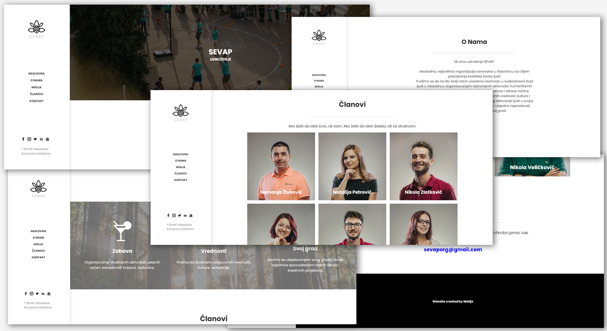

# Sevap Website - Static Website

> Static website built with the basics of HTML & CSS.

This static website is made for the purpose of teaching the basics of HTML and CSS technologies on one of the courses that "Sevap" organization has held.

<!-- toc -->

- [Features](#features)
- [Usage](#usage)

<!-- tocstop -->

## Features

- Sidebar with basic navigation to each section
- Static info separated within several sections
- Modern design

## Usage

- Install Live Server extension
- Start the Live Server

---
